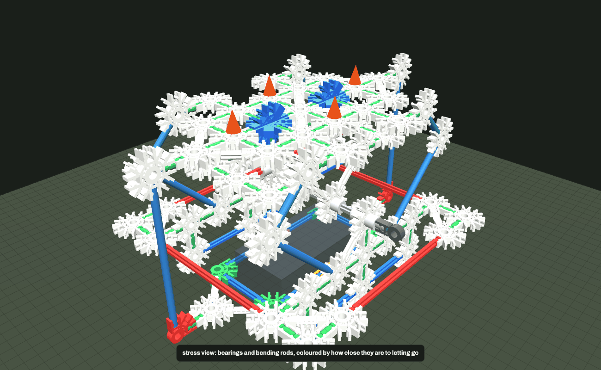
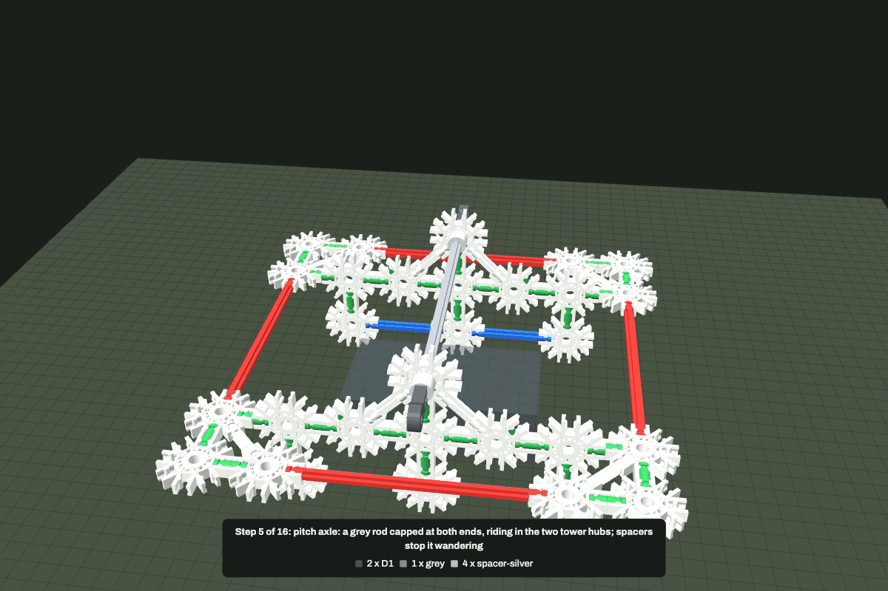

<div align="center">

# knex-cad

**CAD, a checker and a physics engine for classic K'NEX.**


Write a model as a few lines of text. The tool refuses anything that will not snap together<br/>
with real parts, simulates it with gravity and friction, and draws the instruction sheets.

[](https://github.com/MAXMARDONES/knex-cad/stargazers)
[](LICENSE)
[](https://github.com/MAXMARDONES/knex-cad/commits/main)
[](package.json)

<br/>


<br/>

[](skill/SKILL.md)
[](AGENTS.md)
[](LICENSE)

> *Built for a coding agent to drive. Two facts cause almost every K'NEX design mistake, and the checker
> enforces both by line number: rod lengths come only from the `37.5 × √2ⁿ` ladder, and a connector is a
> plane rather than a point.*

</div>

---

## How it works

### You write the nodes. The tool works out whether it can exist.

```
  a few lines of text          the checker                the physics              the drawings
  ──────────────────    ──►    ──────────         ──►     ───────────      ──►     ──────────
  C  A W8 -2,-2,0              every span on              gravity, friction,       instruction
  R  A B                       the ladder, every          bearings, bending,       sheets, a 3D
  H  P W8 0,-2,0 z             joint a real socket,       motors, gears,           bench, stress
  F  DF 0,0,-3 finger          hub or side-clip           strings, breakage        colouring
```

Nothing is guessed. Joints are read off the geometry, so a model that passes is a model that snaps
together, and a model that runs is one that will hold itself up on the table.

### Everything is one command

```bash
node cli.js builds/rig.knx                                   # check: every problem, by line number
node cli.js sim builds/rig.knx --press "finger left"=1       # simulate: press it and see what moves
node cli.js render builds/rig.knx out.svg --view iso         # draw: no browser, deterministic
node cli.js instructions builds/rig.knx docs/instructions    # a sheet per step, LEGO style
node cli.js view                                             # build the 3D bench and open it
```

<div align="center">
<table>
<tr>
<td align="center"><strong>Check</strong></td>
<td align="center"><strong>Simulate</strong></td>
<td align="center"><strong>Draw</strong></td>
</tr>
<tr>
<td><sub>

```
ERR L24: rod A1->P2 span 167.7 mm
  (4.472 U) is not a K'NEX length;
  nearest red 150
ERR L14: N1: the rods leaving it
  are not in one plane. Directions:
  x, y, z. Use two 3D connectors.
```
</sub></td>
<td><sub>

```
pressing finger left with 3.0 N
  mouse travel 11.6 mm
  TL+TR carries 8.0 N
  rod HB-XB: 0.44 N bending it
  WARNING: BL+BR exceeds the
  15 N socket capacity
```
</sub></td>
<td></td>
</tr>
</table>
</div>

---

## Getting started

### Prerequisites

| | | |
|---|---|---|
| **Node.js 18+** | required | the engine, the CLI and the renderer. No npm packages, ever |
| **bash** | required | four small scripts: build, viewer, patterns, install |
| **Python 3 + `cairosvg`** | optional | turns the SVG drawings into PNG. `pip install cairosvg` |
| **A browser** | optional | to open the 3D bench, which is one self-contained HTML file |

Nothing else. No account, no service, no network at run time.

### One clean install

```bash
git clone https://github.com/MAXMARDONES/knex-cad.git
cd knex-cad
./scripts/install.sh
```

It checks what you have, tells you what is missing, builds the engine, verifies the example model, writes
the viewer and **opens the 3D bench with the example loaded**. Roughly:

```
required
  ok   node v22.14.0  (18 or newer)
  ok   bash
optional
  ok   python3 + cairosvg — SVG output also written as PNG

building
  dist/knex.js    78472 bytes
  example model: 0 errors, 0 warnings
  docs/viewer.html 131194 bytes

opening the 3D bench with the example model
```

Put the CLI on your PATH and it works from any directory:

```bash
export PATH="$PWD/bin:$PATH"
knex-cad view          # rebuild the bench and open it
knex-cad parts         # the catalogue
```

### Read the catalogue

```bash
node cli.js parts        # rods, connectors, joints, the physics model and the build rules, one page
```

### Write a model

Coordinates are in lattice units of 37.5 mm. Rod colour is inferred from the distance, so a rod is two
names. **Leave the connector's plane out and the tool derives it from the rods you attach.**

```
T  A tilting bed
!  base frame                  # a build step; the viewer and the instruction sheets use these
C  A W8 -2,-2,0                # connector: name, kind, position, [plane, [socket-0 direction]]
R  A B                         # rod between two connectors
R  A B red beam                # a rod allowed to bend: a force element, not rigid structure
H  P W8 0,-2,0 z               # a hub on the rod through that point: a bearing that spins and slides
S  C W8 1,-2,0 z               # a connector clipped side-on to a rod
P  0.5,-2,0 silver             # spacer
X  mouse 0,0,0.5 62,117,38 mass=85 pad=2,0   # a prop that collides with the model
F  DF 0,0,-3 finger            # an external force you can press in the sim
E  band A B rest=40            # rubber band, pulls only
Y  cord T1 ball via=P4         # string over guides: a pulley
M  motor HUB rpm=45 torque=400 # motor at a bearing, torque limited so it stalls like the real one
G  g1 HUB teeth=34             # gear on an axle; two that touch drive each other
L  HUB                         # tan clip: locks a connector to its rod
O  ball 0,0,1.5 d=25 mass=40   # a ball
A  FOOT                        # clamp a node to the table
W  ballast N1 mass=250         # hang a weight
I  W8=60 blue=20               # what you own; the parts list is checked against it
```

Full grammar in [docs/DSL.md](docs/DSL.md).

---

## The physics

A maximal-coordinate rigid-body engine with sequential impulses, in dependency-free JavaScript. The CLI and
the browser run the same source.

| | |
|---|---|
| **Bodies** | from the rigid partition: end-on joints and 3D pairs weld parts together, everything else is a real degree of freedom |
| **Bearings** | spin, slide and rub, and lock axially when a spacer or cap sits against them |
| **Bending rods** | rigid along their length, springy across it, as compliant constraints rather than stiff springs |
| **Flexi rods** | buckle at a near-constant `π²EI/L²` |
| **Contact** | table, props and balls, Coulomb friction per surface: cloth pad, rubber pad, wood, laminate, glass |
| **Mechanisms** | motors with a torque limit, gear meshes, strings over pulleys, rubber bands, tan-clip locks, anchors, hung weights |
| **Failure** | a joint loaded past what the plastic holds pops, live. Capacity is directional: strong pushing a rod into its socket, weak prying it out of the plane |

```bash
node cli.js sim builds/demo_mech.knx    # motor, gears, string, band and ball in one rig
```

<div align="center">

</div>

### The bench

`node cli.js view` builds a single self-contained HTML file and opens it. It runs the same engine live:

- **Drag any part with the cursor** and a force is applied there, while it runs. Drag the background to
  orbit, shift-drag to pan.
- A **step slider** that builds the model up, with the parts for that step and a camera that walks around.
- A **stress view** that colours bending rods and bearings by how close they are to letting go.
- Joint loads, rod forces, and what broke, updating as it runs.
- The table is there, with the friction you picked.
- **save image** writes the current view at twice the screen resolution.

The build fails if the viewer does not run: `scripts/smoke.js` executes the page's own code in Node
against a stubbed browser, so a throw that would freeze the page is caught before it ships.

---

## Pattern library

Twelve techniques, each a real build, each validated by the checker and drawn from the same file.
Full index in [docs/PATTERNS.md](docs/PATTERNS.md).

<div align="center">
<table>
<tr>
<td align="center"><br/><code>triangulated square</code></td>
<td align="center"><br/><code>cube corner</code></td>
<td align="center"><br/><code>axle in a bearing</code></td>
</tr>
<tr>
<td align="center"><br/><code>leaf spring</code></td>
<td align="center"><br/><code>curved chain</code></td>
<td align="center"><br/><code>ball on a string</code></td>
</tr>
</table>
</div>

### Every connector, drawn face-on with its socket numbering

<div align="center">


<br/>

</div>

---

## Pictures

Every image in this repo is a real render of the model, made by the same renderer the bench uses, driven
headlessly with no interface in the picture.

```bash
node cli.js shot builds/rig.knx out.png view=iso caption="my rig"
node cli.js shot builds/rig.knx stressed.png view=iso stress=1 run=1.5
./scripts/gallery.sh                       # regenerate every image in the repo
```

In the bench itself, **save image** writes the current view at twice the screen resolution.

There is also a line-drawing renderer that needs no browser and no GPU at all, for when you are working
somewhere without one: `node cli.js render builds/rig.knx out.svg --view iso --labels`.

Views: `iso iso2 front back left right top low`. Masking: `hide=props,joints,rods,conns,spacers,loads`.

### Instructions, generated

`node cli.js instructions` walks the build steps, lists what each one needs, and turns the camera as the
model goes up.

<div align="center">

</div>

---

## Built for agents

This repo is meant to be driven by a coding agent, and everything one needs to know is written down.

### Install as a Claude Code plugin

```
/plugin marketplace add MAXMARDONES/knex-cad
/plugin install knex-cad@knex-cad
```

That gives you the skill and five slash commands:

| command | does |
|---|---|
| `/knex-cad:check [build]` | geometry check, every problem by line number, with the fix |
| `/knex-cad:sim [build] [flags]` | run the physics and read the result back in plain language |
| `/knex-cad:render [build]` | draw a view, or generate the whole instruction set |
| `/knex-cad:new [name] [what]` | start a build from a validated pattern, one step at a time |
| `/knex-cad:parts` | the catalogue, the physics model and the build rules |

### Or drop the skill in by hand

```bash
mkdir -p ~/.claude/skills/knex && cp skill/SKILL.md ~/.claude/skills/knex/
```

### Codex, and every other harness

The same guidance is written wherever an agent looks for it:

| harness | file |
|---|---|
| Codex, Amp, Jules, and anything following the convention | [AGENTS.md](AGENTS.md) |
| Claude Code | [CLAUDE.md](CLAUDE.md), plus the plugin above |
| Gemini CLI | [GEMINI.md](GEMINI.md) |
| GitHub Copilot | [.github/copilot-instructions.md](.github/copilot-instructions.md) |
| Cursor, Windsurf, DeepSeek and other rules-file harnesses | `.cursorrules`, `.windsurfrules`, `.rules` |

For Codex's custom prompts, copy the five commands in and you get the same slash commands:

```bash
mkdir -p ~/.codex/prompts && cp .codex/prompts/*.md ~/.codex/prompts/
# then /knex-check, /knex-sim, /knex-render, /knex-new, /knex-parts
```

The deeper reading, for any agent:

- **[docs/ENGINEERING.md](docs/ENGINEERING.md)** — what the geometry forces on you, where stiffness comes
  from, why there are no springs in the box, and the six mistakes made building the example.
- **[docs/PATTERNS.md](docs/PATTERNS.md)** — copy a pattern rather than inventing a node.
- **[research/KNEX.md](research/KNEX.md)** — dimensions from the Glickman patents and measured parts, with
  sources. **[research/TECHNIQUES.md](research/TECHNIQUES.md)** — how people actually build.

Everything runs locally. No account, no service, no network.

---

## Helpers

```bash
node cli.js span 0,0,0 0,3,0      # what rod fits a distance, or how to split it
node cli.js spring                # stiffness of every spring configuration
node cli.js arc --rod blue        # how tightly a chain of rods curves before the sockets let go
node cli.js parts --json          # the whole catalogue as JSON
./scripts/patterns.sh             # validate and redraw the pattern library
python3 scripts/catalog.py        # redraw the part catalogue
```

---

## Layout

```
.claude-plugin/ plugin and marketplace manifests
bin/knex-cad  the CLI, put on PATH when the plugin is enabled
commands/     the five slash commands
skills/knex/  the skill, as the plugin ships it
.codex/       the same commands as Codex prompts
engine/       numbered by load order, concatenated into dist/knex.js by ./build.sh
  01-06       catalogue, vectors, parser, geometry solver, checker, entry point
  07          mass properties and the rigid-body partition
  09-13       physics: bodies, world, impulse solver, collision, mechanisms
viewer/       the 3D bench, assembled into docs/viewer.html by ./build_viewer.sh
scripts/      catalogue drawings, the CAD renderer, CLI reference pages, pattern build
builds/       rig.knx is the worked example; demo_mech.knx exercises every mechanism
patterns/     one technique each, all validated by ./scripts/patterns.sh
research/     dimensions with sources, and building techniques
```

---

## Accuracy

Lengths, socket depth, connector thickness and hub diameter come from US patents 5,061,219 / 5,199,919 /
5,350,331 and from measured parts, cross-checked against the K'NEX User Group. Those you can trust.

The flexi modulus, the rod's second moment of area, the socket capacities, the hub and surface friction and
the rubber band rate are **estimates**; nobody publishes them. Read the forces as ratios and trends, not as
certified values. `node cli.js parts` says which is which.

---

## Roadmap

- [x] `.knx` format, geometry solver, checker with line numbers
- [x] Connector planes derived from the rods you attach
- [x] Rigid-body physics: bearings, bending rods, contact, friction
- [x] Mechanisms: motors, gears, strings, pulleys, rubber bands, tan clips, anchors, weights
- [x] Directional joint capacity and live breakage
- [x] CAD renderer with no browser, and generated instruction sheets
- [x] 3D bench with a live physics tab and stress colouring
- [x] Pattern library, part catalogue, engineering notes
- [x] Claude Code plugin: skill plus five slash commands, and AGENTS.md for Codex
- [ ] Finite-element pass, for the force in every member of a rigid truss
- [ ] Micro and Jumbo K'NEX ladders
- [ ] Export to STL and to LDraw-style part lists
- [ ] Motorised gear trains with ratios solved from a target speed

---

## License

MIT. K'NEX is a trademark of K'NEX Limited Partnership Group; this project is not affiliated with them.

---

<div align="center">

<sub>Built by <a href="https://github.com/MAXMARDONES">Max Mardones</a></sub>

</div>
