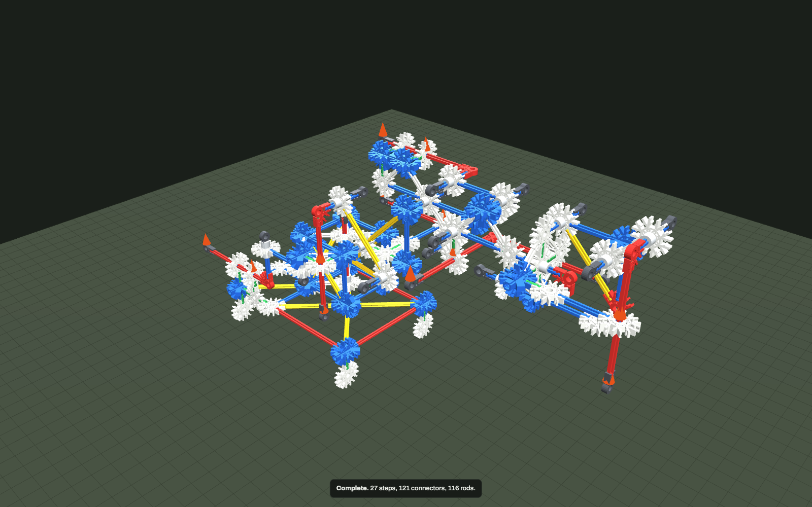

# Six-axis K'NEX robot arm

`builds/robot_arm.knx` — 121 connectors, 116 rods, 36 spacers, ~628 g plus 800 g of base ballast.
Checks clean: **0 errors, 0 warnings**.



Every axis is the same mechanism, a slider-crank, and nothing else:

```
   frame/parent link ──[guide hub]──  ACTUATOR ROD  ──[yoke]── pin rod
                                                                 │ (hub joint = pin)
                                                            COUPLER LINK
                                                                 │ (hub joint = pin)
   child link ────[crank arm]──── pin rod ─────────────────────────
```

A "linear actuator" here is literally a rod sliding through hubs. Its far end carries a **yoke**
(an `R3`) with a short **pin rod** running parallel to the joint axis. A **coupler link** — a rod with
a hub connector at each end — rides that pin at one end and a matching pin on the driven link's
**crank arm** at the other. Spacers 0.2 U either side of every coupler hub park it axially, so the
pins are true revolutes rather than sliding cylinders. There are no gears, no strings under tension
in the drive path, no motors: `F` lines are the push/pull input.

## The two things that decide whether an actuator works

1. **The coupler must be roughly parallel to the slide.** My first yaw drive had the coupler
   perpendicular to the slide; 25 mm of travel bought only 14° of yaw, because the coupler just
   swings and absorbs the motion. Rebuilt parallel it gives 29°/24° for the same push.
2. **A single `F` line is a thruster, not an actuator.** Pushing the elbow slider with 3 N spun the
   whole column 81° and put 54 N through the yaw bearing (the socket limit is 15 N). Every actuator
   therefore has a *pair* of `F` lines, equal and opposite and collinear, one on the slider and one on
   its guide, so the drive is internally balanced the way a real screw jack is. Press both together:

   ```
   node cli.js sim builds/robot_arm.knx --settle 5 --press "elbow"=100';'"elbowr"=100
   ```

   The `F` vectors are declared at 0.01 N so that a gain of 100 is a 1 N push and the settle stays
   neutral (the CLI applies all declared `F` at full strength during the settle phase).

## The six axes

| # | axis | joint | bearing | crank arm | slider | mounted on |
|---|---|---|---|---|---|---|
| 1 | base yaw | about z at the origin | 2 hubs `Y1`,`Y2` on a red vertical axle, spacer-parked so it is a thrust bearing | 2 U arm `CK2` off the column top, pin `CKC` hanging down | red rod along x at y=-2, z=2.5, guides `GH1`,`GH2` | base deck |
| 2 | shoulder pitch | about y at (1,0,4.5) | hub `SH` on the column's front top rail | the upper arm itself, pin at `UA` | red rod vertical at (1,-2), guide `GS1` braced into the column-top triangle | column |
| 3 | elbow pitch | about y at (3,1,6.5) | hub `FH` on an axle cantilevered off `EL` | the forearm's own drop-arm `FK`, pin at (5,2,6.5) | red rod along x at y=3, z=4.5, guide `GE1` | upper arm |
| 4 | wrist pitch | about y at (5,0,6.5) | hub `WH` on an axle off the elbow node | `WT`, the apex of the wrist triangle | red rod along x at y=2, z=7.5, guides `GW1`,`GW2` on a forearm mast | forearm |
| 5 | wrist roll | about x, the hand's own axis | hub `RH` on a blue shaft `WA`→`RCAP` | `HL`, 1 U below the roll axis, pin running back along x | red rod along y at x=5, z=5.5, guide `GR1` | wrist link |
| 6 | gripper | about y at (8,1,7.5) | hub `JH` on an axle through the top of the hand | the jaw arm itself, pin at `JT` | red rod vertical at (11,-1), guide `GG1` on a bracket off `HB` | hand (rolls with axis 5) |

The gripper is one moving jaw (`JH`→`JT`→`JD`) closing past a fixed anvil `JF` that sticks forward
from the bottom of the hand — a scissor grip, not a parallel one.

Six sliding joints and six revolutes appear in the physics report, which is the check that the six
axes are real and independent:

```
joint GH1+GH2 hub about -x (free to slide)     axis 1
joint GS1     hub about -z (free to slide)     axis 2
joint GE1     hub about -x (free to slide)     axis 3
joint GW1+GW2 hub about -x (free to slide)     axis 4
joint GR1     hub about -y (free to slide)     axis 5
joint GG1     hub about -z (free to slide)     axis 6
```

## Holding a pose: two opposed rubber bands per actuator

Classic K'NEX has no springs and a rod sliding in a hub has no axial friction in this engine, so an
unpowered slider-crank is a 1-DOF mechanism that simply falls. Each actuator therefore has a pair of
opposed rubber bands (`E` lines) anchored between the slider and its guide, which makes each axis a
centred, position-controlled spring. The shoulder needs about 210 N·mm to hold the arm out, which is
more than one band can give, so it uses three bands in parallel (`shoB1..3`); the wrist pitch uses two.
No band exceeds 3.9 N; the documented estimate for "near a band's limit" is 3 N.

## Measured behaviour

`node cli.js sim builds/robot_arm.knx --settle 5 --seconds 1.5`

**At rest, no input** (settle 5 s): every body is stationary to within 0.8 mm. The settled pose is
within a degree of the drawing at the column (-0.2° yaw), shoulder (-0.3°) and elbow (+4.3°); the
wrist link sits 23° below the drawn pose because its bands cannot quite balance the hand and gripper.
Peak joint loads at rest: `SCP`/`SAP` 9.5 N, `GS1` 9.1 N, everything else below 8 N, against an
estimated 15 N socket pull-out. Nothing is close to popping.

**Pressing each actuator with 1 N**, action and reaction together, for 1.5 s. "travel" is the slider's
motion relative to its own parent link (read from the change in its gauge band's length); "joint" is
the change in the driven joint's angle; TCP is the moving jaw's centre of mass, about 400 mm out.

| axis | push | slider travel | joint angle | TCP move (dx,dy,dz mm) | \|TCP\| |
|---|---|---|---|---|---|
| 1 yaw | + | −3.4 mm | +2.33° | (−0.8, +13.9, +1.0) | 14.0 |
| 1 yaw | − | +2.2 mm | −2.04° | (+1.4, −12.7, +0.8) | 12.8 |
| 2 shoulder | + | +7.8 mm | −5.85° (arm up) | (−6.7, −1.6, +18.8) | 20.0 |
| 2 shoulder | − | −36.9 mm | +52.6° (collapses) | (+14.5, +9.2, −92.1) | 93.7 |
| 3 elbow | + | +8.0 mm | −6.19° | (−3.7, −2.2, +22.6) | 23.0 |
| 3 elbow | − | −9.0 mm | +7.75° | (+0.5, +0.6, −15.3) | 15.3 |
| 4 wrist pitch | + | −7.0 mm | −10.87° | (+8.0, −35.5, +42.0) | 55.6 |
| 4 wrist pitch | − | −17.0 mm | −25.84° | (+8.6, −1.1, +57.4) | 58.1 |
| 5 wrist roll | + | +4.0 mm | +5.97° | (+1.7, −2.9, +3.5) | 4.9 |
| 5 wrist roll | − | −4.0 mm | −5.81° | (−0.7, +2.3, −2.2) | 3.3 |
| 6 gripper | + | +6.0 mm | −4.83° (jaw opens) | (+10.6, −38.8, +84.8) | 93.9 |
| 6 gripper | − | −5.0 mm | +3.64° (jaw closes) | (+5.2, −3.3, +41.8) | 42.3 |

No run at 1 N exceeded the 15 N socket capacity on any joint, and nothing broke or flew apart.

Read the directions like this: **yaw** swings the tool point sideways in y, ±13 mm per 2°; **shoulder**
and **elbow** move it almost purely in z, ±15 to 23 mm; **wrist pitch** is the biggest lever at the
tool point, ±55 mm; **roll** turns the hand about its own axis so the tool point barely translates
(3–5 mm) but the jaw plane rotates 6°; the **gripper** opens and closes the jaw 3.6–4.8° per 5–6 mm of
slider, which is 8–11 mm of jaw-tip gap.

At 1.5 N the numbers roughly double for axes 1, 3, 5 and 6; the shoulder and wrist go nonlinear.

## What I could not make work

- **The shoulder is nearly bistable, and pushing it down collapses the arm.** A spring-balanced arm has
  a gravity torque that falls as `cos θ` while the band force rises linearly, so there are two stable
  poses: the drawn one and a ~50° droop. 1 N in the "up" direction gives a clean −5.9°; 1 N "down"
  tips it over the hump and it falls 52°. The right fix is a counterweight, which gives an
  angle-independent balance — I could not find a legal place to hang one: every backward route from
  the shoulder at y=0 crosses the yaw axle or its cap, and the routes at y=±2 collide with the yaw
  crank arm or the shoulder guide. A real build would put the boom outboard and accept the width.
- **Band tuning is coupled across the whole arm.** Stiffening the wrist bands moved the shoulder by
  50°, twice, because it flipped the shoulder between its two equilibria. The tune shipped is a
  compromise: column, shoulder and elbow sit on the drawing, the wrist sits 23° low.
- **Only four of the six actuators have two guide hubs.** The shoulder, elbow and roll sliders have
  one. A guide hub's plane is perpendicular to the slider, so it can only reach out sideways; two
  guides need two independent brackets in two parallel planes, and there was no rigid parent structure
  at the second plane. The engine merges two hubs on one rod into a single joint anyway, so the
  physics is identical — this is a buildability shortfall, not a simulation one.
- **Every bearing is a single cantilevered hub**, not a fork. Two hubs on one axle would need to be
  tied to each other, and the tie can only run in the plane perpendicular to the axle, which does not
  close a triangle. In the engine a single hub fully constrains the two off-axis rotations, so it is
  rigid; on a table it would splay.
- **The guide brackets for axes 3, 4 and 6 are cantilevers** of 2–3 U rather than trusses, for the same
  planar reason.
- **Reach is 412 mm from the yaw axis**, which is more than I wanted; the base is 225 × 150 mm with
  800 g of ballast at the back, and the sim shows it neither tips nor slides.

## Parts

```
B7 46   D1 22   R3 8    W8 45
green 24  white 22  blue 45  yellow 14  red 11
spacer-silver 36
```
Plus 14 rubber bands and two 400 g ballast weights on the rear deck.
