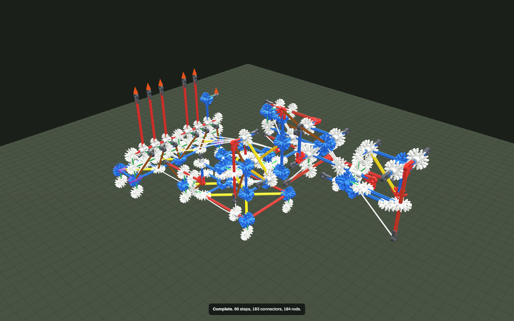

# Cable-driven robot arm with an operator lever stand

`builds/robot_arm_levers.knx` — 183 connectors, 184 rods, 50 spacers, ~925 g plus 800 g of base
ballast. Checks clean: **0 errors, 0 warnings**.



The arm is [`builds/robot_arm.knx`](ROBOT_ARM.md) — same six slider-crank axes, same links, same
bearings. That file is unchanged and is still the direct-drive reference. What is different here is
everything about how it is driven and how it is held up:

| | direct-drive reference | this build |
|---|---|---|
| input | 12 `F` lines, each a hand shoving a slider along its own axis | 6 `F` lines, each a hand on a lever handle |
| drive path | none — the finger is on the slider | 6 strings, 22 guide passes over 13 distinct guides |
| holding the pose | opposed bands on each slider | zero-free-length balance bands across each pitch joint |
| droop at rest | **84.3 mm** at the tool point (wrist 23.1° low) | **0.9 mm** (every joint within 1.2°) |
| shoulder | bistable; 1 N down collapses it 52° | monostable; 0.3 N gives +5.96° down / −5.17° up and returns |

---

## 1. The operator stand

A separate console standing on the desk behind the machine, `A`-anchored at `KB0`. It has to be
anchored: a lever is a hand pushing on the world, and an un-anchored console would ride away every
time a lever was used (`sim` says so — "a body is held by nothing and an F is driving it like a
rocket").

```
    z=7.5   handle tops  LBMh LSWh LSTh LWRh LGRh      (LRLg, the roll grip, is at z=5.5)
              |    |    |    |    |
    z=3.5   ==*====*====*====*====*====*==   lever axle, two red rods, 6 free hubs on it
             /|   /|   /|                    each hub: handle up 4U, cable arm back-down 1.4U,
    z=2.5   =*====*====*====*====*====*=     return arm forward 1U
                fairlead rail (9 nodes, green rods, rigid)
    z=1.5   deck, 8U x 2U, 4 cells, all triangulated
    z=0.5   four feet
```

- **The axle** is two red rods `KA4n–KA0–KA4p` at x=-7, z=3.5. Six `H` hubs ride it at y = -3, -2,
  -1, 1, 2, 3, each parked between two silver spacers so it can turn but not walk along the axle.
  Each hub is its own bearing, so the six levers are mechanically independent.
- **The fairlead rail** at z=2.5 is a chain of nine 1U green rods with a real connector at every
  node, *not* hubs on a long rod. That was deliberate: a free hub would slide and spin under cable
  load and would add six near-massless bodies to the physics. Rigid nodes cost nothing and cannot
  move.
- **The front face is a truss**: three posts at y = -4, 0, 4, and eight white knee braces
  (`KRn3–KA4n`, `KRn3–KF4nv`, …) closing every panel between the deck, the rail and the axle.
- **Each lever has three arms**: handle 4U up (the only place a hand touches this model), cable arm
  1.4U back-and-down carrying the string, return arm 1U forward carrying a band down to the deck.

**Why three arms and not two.** The return band has to make a *positive* torque about the axle —
the direction that pushes the handle forward and keeps the cable taut. Torque about y is
`r_z·F_x − r_x·F_z`, so a band pulling straight down (`F_z < 0`) only helps if `r_x > 0`: the arm it
pulls on must be **in front of** the pivot. Hung off the backward-and-down cable arm the same band
makes exactly zero torque (the force line passes through the pivot) or the wrong sign. That cost me
three attempts before I wrote the cross product down.

### Operator layout

| lever | y | handle | drives | push the handle forward → |
|---|---|---|---|---|
| `LBM` BOOM | -3 | 4U red, z=7.5 | axis 2, shoulder pitch | boom **down** (excavator convention) |
| `LSW` SWING | -2 | 4U red, z=7.5 | axis 1, base yaw | slews **-y** |
| `LST` STICK | -1 | 4U red, z=7.5 | axis 3, elbow pitch | forearm **up** |
| `LWR` WRIST | +1 | 4U red, z=7.5 | axis 4, wrist pitch | wrist **down** |
| `LGR` GRIP | +2 | 4U red, z=7.5 | axis 6, gripper | jaw **opens** (spring-closed, so a dropped lever grips) |
| `LRL` ROLL | +3 | crank: 2U arm + grip along the axle | axis 5, wrist roll | — it **spins**: turn the grip and the hand rolls |

Left hand on the boom/swing/stick group, right hand on the wrist/tool group, exactly as the two
joysticks of an excavator are split. The roll control is deliberately not a lever: it is a crank
handle whose grip runs along the axle, so the operator turns it round instead of pushing it fore and
aft, and the hand rolls with it.

Directions are as measured in the table in §4, not as intended: the stick and gripper cables both
pull in the direction that raises/opens, because those were the routes whose first segment stayed
closest to the slider's own axis. Gravity is the antagonist for both, which makes the gripper
spring-closed — let go of the lever and the jaw holds whatever it has.

---

## 2. Cable routing

Six `Y` strings. Each runs: **lever cable arm → fairlead node on the console → guides → the far cap
of that axis's slider rod**. Nothing pushes; every drive is a pull.

```
cabSwing  LSWc -> KRn2 -> AC1
cabBoom   LBMc -> KRn3 -> R1 -> BG2 -> AS1
cabStick  LSTc -> KRn1 -> YCAP -> SGY -> AE1
cabWrist  LWRc -> KRp1 -> YCAP -> SGY -> EL -> AE4
cabRoll   LRLc -> KRp3 -> YCAP -> SGY -> EL -> FK -> AE5
cabGrip   LGRc -> KRp2 -> YCAP -> SGY -> EL -> FK -> WA -> AE6
```

### The rule that makes this work: every guide sits on a joint axis

A cable that crosses a moving joint changes length when that joint moves, and a taut inextensible
string then drags the axis at the far end. That is the whole crosstalk problem in a cable arm. The
fix is old and exact: **put the guide on the rotation axis it crosses.** The distance from a point
*on* an axis to any point rigidly attached to the child link does not change when the child rotates
about that axis, so the routed length is invariant.

| guide | position | on which axis | belongs to |
|---|---|---|---|
| `YCAP` | (0,0,5.5) | yaw axis (x=0, y=0) | base |
| `SGY` | (1,2,4.5) | shoulder axis (x=1, z=4.5, any y) | column |
| `EL` | (3,0,6.5) | elbow axis (x=3, z=6.5, any y) | upper arm |
| `FK` | (5,1,6.5) | wrist-pitch axis (x=5, z=6.5, any y) | forearm |
| `WA` | (7,0,6.5) | roll axis (y=0, z=6.5, any x) | wrist link |
| `BG2` | (1,-2,1.5) | — a plain 90° turn | base |

Only two of those are new parts: `SGY`, an `R3` hanging 1U off the column top ring on a green rod, and
`BG2`, a spacer-parked hub riding the base's front rail. All the others are connectors the arm
already had, used as fairleads — `YCAP` is the cap on top of the yaw axle, `EL` the elbow node, `FK`
the forearm knee, `WA` the wrist's forward node. On a real table you would slip a spare hub or a
grey cap over each one; in the model a `via=` point is just a point on a body, and the two segment
tensions are applied there.

The chain of guides for the gripper cable — `YCAP → SGY → EL → FK → WA` — crosses the yaw, shoulder,
elbow, wrist and roll joints in order and is decoupled from all five.

**`BG2` earns its place.** Before it existed the boom cable left `AS1` at 45° for the nearest base
node `P2`, and the horizontal half of that pull yawed the whole column: the boom lever swung the
machine ±1.7° every time it was used. With `BG2` sitting directly under `AS1` the pull on the slider
is exactly vertical, a vertical force makes no torque about a vertical axis, and the boom's swing
crosstalk fell to ±0.03°. Measured, not argued.

---

## 3. How each axis is balanced

A string can only pull, so every axis needs an antagonist, and the antagonist has to hold the arm up
by itself or the arm droops the moment the operator lets go.

### The gravity balance: three masts and nine bands

Three masts stand 2U directly above a pitch axis, each on the link *below* that axis, and a bundle of
rubber bands with a near-zero rest length runs from the mast top to a point on the link *above*:

| axis | mast | stands on | band | attaches to | bands |
|---|---|---|---|---|---|
| shoulder | `SBM` (1,2,6.5) | column, via `SGY` | `balSh1..4` | `ECAP` (3,2,6.5) | 4 × k=0.0262, 1.8 N each |
| elbow | `EBM` (3,0,8.5) | upper arm, via `EL` | `balEl1..3` | `WBM` (5,-1,8.5) | 3 × k=0.0179, 1.4 N each |
| wrist | `WBM` (5,-1,8.5) | forearm, via `WCAP` | `balWr1..2` | `WT` (6,0,7.5) | 2 × k=0.0336, 2.0 N each |

A band whose rest length is nearly zero pulls with a force proportional to its own length, so with
the anchor at height `h` directly above the pivot and the attach point at radius `r`, its torque is
`k·h·r·cos θ` — the *same* `cos θ` that gravity makes. That is why this holds the arm at **every**
angle rather than at one angle, and it is why the shoulder is no longer bistable. It is the
anglepoise-lamp trick, and it is the only thing in the classic K'NEX box that behaves like a constant
gravity compensator.

Two details that are easy to get wrong, and that I got wrong first:

1. **The attach point must be at a steeper angle than the link's centre of mass.** With `φ_a` the
   angle of the attach point above the pivot and `φ_c` that of the CoM, the net stiffness at balance
   is `M g R_c (sin φ_c − cos φ_c · tan φ_a)`, which is restoring only when `φ_a > φ_c`. My first
   attempt attached the shoulder band at `UA` (level with the pivot, `φ_a = 0`) with the CoM at 22°,
   and the arm was *more* bistable than before: k=0.0223 dropped it 70°, k=0.045 threw it up 86°,
   with nothing stable in between. Moving the attach to `EL`/`ECAP` at 45° made it settle at 0.2°.
2. **Put the band in the plane of the motion.** The shoulder band originally ran from `SBM`(y=2) to
   `EL`(y=0), so 7 N of its 10 N was a sideways pull that did no work and simply loaded the shoulder
   bearing: `SH` read 13.9 N against an estimated 15 N socket limit. Re-attaching to `ECAP`, which
   is at the same y as the mast, made the pull purely fore-and-aft, cut the force needed by 35 %, and
   dropped `SH` to 10.2 N.

### The centring bands

Every slider keeps a light opposed pair of bands, retuned from the reference. Their job is no longer
to hold the arm up — the balance bands do that — it is to (a) return the axis when the cable pays
out and (b) supply a preload that exactly cancels the cable's pretension so that the drawn pose is
the rest pose. That second job is what the final tuning pass adjusts:

| axis | band biased against the cable | value |
|---|---|---|
| yaw | `yawA1/2` (pulls the slider +x, against `cabSwing`) | k 0.08 → **0.148** |
| boom | `shoB1` (pulls `AS1` up, against `cabBoom`) | rest 35→**50**, k 0.055→**0.04**, three bands → one |
| stick | `elbA` (pulls the slider -x, against `cabStick`) | rest 28→**10**, k **0.063** |
| wrist | `wriA1` (pulls the slider -x, against `cabWrist`) | rest 15→**26**, k 0.035→**0.04**, two bands → one |
| roll | `rolB` weakened (against `cabRoll`) | rest 55→**69** |
| grip | `griA`/`griB` unchanged | — |

At rest all six cables sit at **1.52–1.56 N**, which is the console's pretension; no band exceeds
2.1 N against the documented 3 N "near the limit"; the heaviest joint carries 9.1 N against the 15 N
socket estimate.

### Lever return bands

`rbBM rbSW rbST rbWR rbGR rbRL`, one per lever, from the forward return arm down to the deck,
1.7–2.0 N each. These are what the operator pushes against, what puts the lever back when he lets go,
and what keeps the cable taut when he is not touching it.

---

## 4. Measured behaviour

### At rest, gravity only

`node cli.js sim builds/robot_arm_levers.knx --settle 6` — no press, no input, all loads at gain 0.
Rotations are measured from the **drawn** pose.

| link | this build | direct-drive reference |
|---|---|---|
| column yaw | +0.09° | +0.01° |
| upper arm (shoulder) | **+0.24°** | −0.15° |
| forearm rel. upper arm (elbow) | **+0.12°** | +4.61° |
| wrist link rel. forearm | **−0.32°** | **+18.65°** |
| hand roll | +0.42° | −0.12° |
| jaw rel. hand | −1.14° | +1.11° |
| **tool point off the drawing** | **0.9 mm** | **84.3 mm** |
| peak joint load at rest | 9.1 N | 9.6 N |

The droop is gone: 84.3 mm → 0.9 mm, a factor of 94. Nothing snaps, nothing leaves the desk, no
joint is near the 15 N socket estimate.

The reference's other failure — *"pushing the shoulder down collapses the arm ~52° because the spring
balance is bistable"* — is gone too. There is no longer any way for the operator to push a joint at
all, and the boom lever's two directions are now symmetric: +5.96° down, −5.17° up, from the same
0.3 N.

### One lever at a time

`--press "<lever>"=30` — 0.3 N on that handle and nothing else, 1.2 s ramped over 80 ms, then a
0.25 s window at full load to read the cable tension. Angles are the change from the settled pose;
the driven axis is in **bold**; everything else in those six columns is crosstalk. Tool motion is
the moving jaw's tip, ~400 mm out.

| lever | cable N | swing ° | boom ° | stick ° | wrist ° | roll ° | grip ° | tool dx,dy,dz mm | \|d\| |
|---|---|---|---|---|---|---|---|---|---|
| SWING push | 2.69 | **−2.65** | +0.09 | −0.02 | +0.00 | +0.06 | −0.00 | 1.5, −17.4, −0.4 | 17.5 |
| SWING pull | 0.44 | **+2.60** | −0.02 | −0.00 | +0.08 | −0.06 | +0.00 | −2.1, +17.0, −0.2 | 17.1 |
| BOOM push | 2.59 | −0.03 | **+5.96** | −0.25 | −0.46 | −0.01 | −0.03 | 9.7, −0.2, −33.0 | 34.4 |
| BOOM pull | 0.45 | +0.02 | **−5.17** | +0.57 | +0.76 | −0.00 | +0.03 | −10.3, 0.1, +24.9 | 26.9 |
| STICK push | 2.64 | +0.17 | +0.04 | **−5.19** | −0.01 | +0.00 | +0.01 | −4.6, 1.1, +23.4 | 23.9 |
| STICK pull | 0.46 | −0.04 | +0.01 | **+5.56** | −0.05 | −0.01 | −0.02 | 2.5, −0.2, −25.5 | 25.6 |
| WRIST push | 2.70 | +0.18 | −0.18 | −0.20 | **+7.08** | −0.03 | −0.02 | 2.9, 1.2, −21.4 | 21.6 |
| WRIST pull | 0.41 | −0.05 | +0.14 | −0.00 | **−7.32** | +0.01 | +0.02 | −6.2, −0.3, +22.8 | 23.6 |
| ROLL turn + | 2.10 | +0.00 | −0.01 | +0.02 | +0.03 | **+4.14** | −0.00 | 0.0, −2.9, +2.5 | 3.8 |
| ROLL turn − | 0.97 | −0.02 | +0.01 | +0.00 | +0.04 | **−4.20** | −0.00 | 0.0, +2.7, −3.0 | 4.0 |
| GRIP push | 2.71 | +0.01 | +0.44 | +0.47 | +1.71 | +0.40 | **−1.85** | 2.2, −0.2, −7.7 | 8.0 |
| GRIP pull | 0.36 | −0.02 | −0.13 | −0.17 | −0.64 | −0.22 | **+1.88** | −0.8, 0.0, +1.0 | 1.3 |

How to read it:

- **Every lever drives its own axis in both directions.** Push and the cable tension climbs from its
  1.5 N pretension to 2.1–2.7 N and pulls; pull the handle back and the tension drops to 0.36–0.97 N,
  the cable pays out, and the axis's own band or gravity takes it the other way. Six levers, twelve
  usable commands.
- **Crosstalk is under 0.8° everywhere except the gripper.** The worst single number in the table is
  GRIP push moving the wrist +1.71°, which is 23 % of the wrist's own authority. The gripper cable is
  the long one — six guides, 891 mm — and it is the one whose reaction at `WA` and `FK` is largest.
  Everything else is 0.0–0.8°, i.e. 1–15 % of the driven axis.
- **The swing has essentially no crosstalk at all** (≤0.09°) because its cable never leaves the base.
- **The roll crank is the cleanest axis in the machine**: ±4.2° with every other axis inside 0.04°.
  That is what routing through `YCAP → SGY → EL → FK` buys.
- **No lever is dead and no lever moves everything.** The smallest is the gripper at ±1.86°, which is
  still 8–12 mm of jaw-tip gap.

Peak joint loads over all twelve presses at 0.3 N: 11.5–13.4 N, all under the 15 N socket estimate;
nothing snapped and nothing left the desk in any of them.

---

## 5. What I could not make work

- **The console has more authority than the arm's sockets.** The handle is 4U from the axle and the
  cable arm 1.4U, so the lever multiplies about 2.8× into the cable and more again through the
  slider-crank. At 0.3 N per handle everything is comfortable. At **1 N** the arm is over-driven:
  `boom −100` peaks at 23.1 N through `Y1+Y2`, `SH`, `SCP`, `SAP`, `GS1`, `FH`, `LBM` and `BG2`, and
  `grip −100` reaches 57.6 N. Nothing breaks in the sim at those loads because breakage is judged
  per rod, but the checker's own 15 N socket estimate says those joints would pop on a table. The
  honest operating range of this console is a light hand, and the fix is a shorter handle (2U, a
  1.4:1 ratio) or a longer cable arm — I left the 4:1 in because it gives the operator a usable throw
  and documented the limit instead.
- **The pose is set by a spring balance, not by the cable length.** I wanted the inextensible cable to
  *define* the pose: set `rest = L0` and the drawn pose becomes a hard kinematic stop. It does not
  work that way, because the lever's own return band keeps rotating the lever until the cable goes
  taut, so the equilibrium is wherever the lever band and the axis band balance through the cable —
  a spring balance with the console as its reference. That is why the tune has two knobs per axis
  (lever band strength, axis band preload) and why they interact. A real machine solves this with a
  drum and a detent; there is no detent in this DSL.
- **Tuning is still coupled, just much less than before.** The reference's note that "stiffening the
  wrist bands moved the shoulder by 50°" is fixed — the balance bands localise each axis — but the
  *cables* re-introduce a weaker coupling: adding `BG2` shortened `cabBoom` by 53 mm and moved the
  settled shoulder by 1.9°, which needed the shoulder balance retuned from 0.0250 to 0.0262. Change a
  route, re-run the tune.
- **The gripper's wrist crosstalk (1.71°) is not fixed.** In principle it should be zero: both the
  `FK→WA` segment and the `WA→AE6` segment have force lines that pass through an axis, so neither
  makes torque about the joint it crosses. I believe the residual is second-order — the wrist is very
  nearly neutrally stable once its gravity is balanced, so a small disturbance produces a visible
  angle. Stiffening `wriA1`/`wriB` would trade that crosstalk against wrist authority.
- **A single-acting cable per axis, not a pair.** A proper cable machine has two cables per axis
  wrapped opposite ways on a drum. Here each axis has one cable and one spring, so "pull back" gets
  its motion from the spring rather than from the operator, and the two directions are not quite
  symmetric (boom +5.96 / −5.17, wrist +7.08 / −7.32). Two cables per axis would need a second guide
  path to the other end of each slider; for the yaw and the wrist that route crosses the column.
- **The lever bank is 300 mm wide.** Six hubs 1U apart on a 8U axle with three posts. Two shorter
  axles at different heights would be more compact but the cable arms of the front bank would sweep
  through the cables of the rear one.
- **Four cables pass over `YCAP`**, a single `D1` cap on top of the yaw axle. That is a plausible
  fairlead in the model and a mess on a table; a real build wants a small cluster of hubs there.

## Parts

```
B7 54   D1 41   P4 4    R3 11   W8 73
green 50  white 36  blue 62  yellow 18  red 18
spacer-silver 50
```

Plus 6 strings, 29 rubber bands and two 400 g ballast weights.

## Reproducing the numbers

```bash
node cli.js builds/robot_arm_levers.knx                                    # 0 errors, 0 warnings
node cli.js sim builds/robot_arm_levers.knx --settle 6                     # rest pose, loads
node cli.js sim builds/robot_arm_levers.knx --settle 6 --press "boom"=30   # one lever, 0.3 N
node cli.js shot builds/robot_arm_levers.knx docs/patterns/robot-arm-levers.png
```

Note on reading string tension from `sim`: the numbers on the `string …` lines are not newtons. The
engine warm-starts a string's constraint multiplier and never resets it, so `report()` divides an
impulse accumulated since the string last went slack by one timestep. A 100 g ball hanging on a taut
string reports 491 kN, and the figure grows by about 1 N of "tension" for every second of simulated
time. The tensions in the table above were measured by sampling the multiplier every step over a
0.25 s window and averaging the per-step increments; the dynamics themselves are correct.
