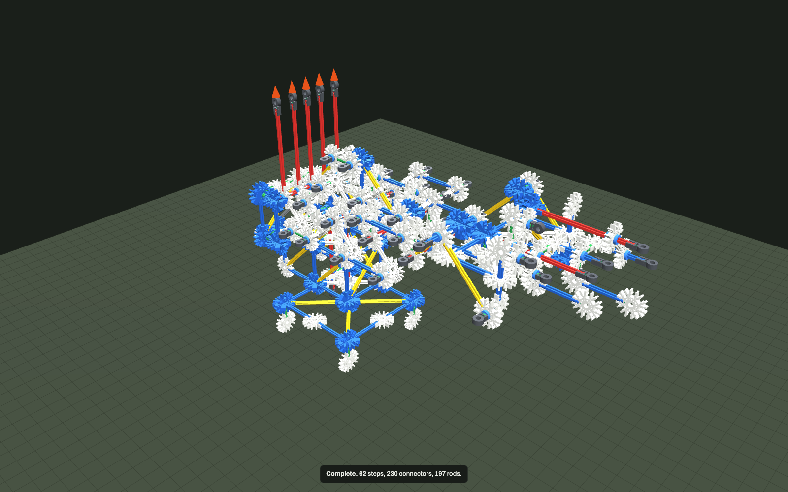

# Six-axis arm on a Caterpillar lever stand

`builds/robot_arm_linkage.knx` — 230 connectors, 197 rods, 105 spacers, ~1085 g of parts plus 600 g
of base ballast and 957 g of lever counterweights. Checks clean: **0 errors, 0 warnings**.



The same six axes as [`builds/robot_arm.knx`](ROBOT_ARM.md), but with a hard rule: **no string, no
cable, no rubber band anywhere in the drive**. There is not one `Y` or `E` line in the file. Every
axis is worked from a bank of levers by rods, cranks, sliders and one gear pair, so every lever
**pushes as well as pulls** and no axis needs a return spring.

```
        handles                                    the arm, drawn straight out at z = 244 mm
        ||||| 4U red                     shoulder   elbow    wrist   roll  jaw
          |                                  |        |        |      |     |
   +------+------+   console        +--------+--------+--------+------+-----+
   | lever shaft |   (rides the     |  upper arm      forearm   wrist link  |
   |  5 bell     |    house)        |                                       |
   |  cranks     |                  |  4 relay cranks ride the shoulder     |
   +------+------+                  |  shaft, 3 more ride the elbow shaft,  |
          |  couplers               |  2 more ride the wrist shaft          |
   +------+---------+---------------+
   |  HOUSE: braced box on two hubs on the yaw axle                        |
   +---+---------------------------------------------------------+--------+
       | 34T gear on the yaw bearing  <-- 14T pinion <-- tiller            |
   +---+--------------------------------------------------------+---------+
   |  BASE deck, four feet, all four anchored (A), 600 g ballast          |
   +----------------------------------------------------------------------+
   ==================== desk ==============================================
```

## The three things a rigid drive can do, and where each is used

**Rotation.** A rod through hub joints is a shaft. A tan clip (`L`) locks a connector to its shaft so
the two turn together. Four of them: the swing tiller is clipped to the pinion shaft, and the upper
arm, forearm and wrist link are each clipped to their own shaft, so link and shaft are one body while
the relay cranks ride *free* hubs on that same shaft. That is the whole point of a clip here — one
shaft, one member locked to it, the rest turning on it. Gears couple the swing: **34 + 14 teeth mesh at exactly 37.5 mm, one green rod**,
so the pinion shaft stands one unit from the yaw axle. (Two 34s would want a white rod; the 14/34 pair
wanting a green one is the same coincidence one step down the ladder.)

**Translation.** Two push rods, each a blue rod sliding through one guide hub with a connector at each
end. They live on the wrist link and do the one job nothing else can: turn the corner between a drive
that rotates about **y** and a joint that rotates about **x**.

**Angle.** Bell cranks and four-bars everywhere else. Ten relay cranks ride the joint axes themselves,
which is the trick that lets a lever at the base reach past a joint (below).

## The relay, and why the arm does not fold up when the shoulder moves

A lever at the base drives a link that is three joints away. Put the relay crank's pivot **exactly on
the intervening joint axis**, make its output crank equal and parallel to the driven link's crank, and
make the coupler equal and parallel to the link between the two axes, and you have a parallelogram:

```
     shoulder axis                     elbow axis
          o---------- 2U coupler ----------o          <- coupler || upper arm
          |                                |
        1U crank                        1U crank      <- equal, parallel
          |                                |
          O========== upper arm 2U ========O
       relay rides                    relay rides
      a free hub on                  a free hub on
     the shoulder shaft              the elbow shaft
```

The relay's **absolute** attitude is what the lever sets, and it stays put however the shoulder moves.
Every stage of axes 3, 4, 5 and 6 is built this way. The visible consequence is in the press table:
pressing the shoulder lever swings the upper arm 3° and the tool point moves only 3.3 mm, because the
forearm, wrist and hand are carried along without rotating — a backhoe's levelling linkage.

## The six transmissions

### Axis 1 — swing, by gears

```
  tiller (tan-clipped to the pinion shaft, swings sideways)
      |
   [ L ]  pinion shaft, a free red rod in two house hubs at (-1,0,·)
      |
   14T pinion  ---- meshes at one green rod ---->  34T gear on the yaw bearing hub Y1
                                                   (joint: house vs base)
  carrier = the house, so turning the pinion walks the house round the fixed gear: 3.44 : 1
```

The tiller is the only control that moves sideways; the other five move fore and aft, exactly like the
swing lever on a real machine. Note what the tan clip is for: without `L YLV` the tiller would spin
inside its own hub and drive nothing.

### Axis 2 — shoulder, one four-bar

```
   lever 2 ---- yellow crank ----o
   (-2,0,6.5)                    |  green coupler
                                 o---- 2U mast on the upper arm
                                      |
                              upper arm o---- elbow
```

### Axis 3 — elbow, one relay

```
  lever 3 --green crank--o--white coupler--o RS3 (shoulder axis) --white crank--o
                                                                                | 2U coupler
                                            forearm crank at the elbow ---------o
```

### Axis 4 — wrist pitch, two relays

```
  lever 4 --green crank--o--white--o RS4 (shoulder axis) --green crank--o
                                                                        | 2U coupler || upper arm
                                              RE4 (elbow axis) ---------o
                                              --white crank--o
                                                             | 2U coupler || forearm
                                    wrist link crank --------o
```

### Axis 5 — wrist roll, three relays and a slider

```
  lever 5 -> RS5 (shoulder) -> RE5 (elbow) -> RW5 (wrist)
                                               |
                                         yellow coupler (45 deg to the slide)
                                               |
                          vertical slider on the wrist link, one guide hub
                                               |
                                     white coupler in the y-z plane
                                               |
                                      crank on the hand, 1U below the roll axis
                                               |
                                   the hand turns on the roll stub
```

Both ends of the roll coupler are hubs on pins that run along **x**, so that little four-bar lives
entirely in the y-z plane; the slider is the shared body that belongs to both planes at once.

### Axis 6 — gripper, four relays, a slider and a relay on the roll axis

```
  lever 6 -> RS6 -> RE6 -> RW6 -> second vertical slider on the wrist link
                                        |
                                 yellow coupler
                                        |
                     RJ, a bell crank riding the roll stub itself
                                        |
                                 white coupler
                                        |
                         jaw crank; the jaw swings in the y-z plane past a fixed anvil
```

RJ rides the roll stub because **a rigid link cannot cross a full-rotation joint unless it is coaxial
with it.** Putting the jaw's driving pivot on the roll axis is the only arrangement that does not tear
itself apart when the hand rolls; the price is that roll and jaw are coupled (see the table).

## What carries all of it

* **Base**: a 4U square deck at z = 1.5 U on four feet, all four `A`-anchored, 600 g of ballast at the
  back. The yaw axle is a red rod standing on the centre 3D pair.
* **House**: the original braced box on two spacer-parked hubs, but with its **-x face left open** —
  no face diagonal there — so the swing pinion can run down it and the console can hang off it.
* **Console**: a deck at z = 4.5 U cantilevered off the house's -x face, braced **down** to the house's
  lower ring by two struts, plus a 2U mast at x = -3 with two yellow diagonals. The lever shaft is a
  red rod one unit in front of the mast, held at both ends and braced back to the deck.
* **Shoulder yoke**: the shoulder shaft is a free red rod on two hubs (N1, N2) carried on 2U posts off
  the house top ring, each triangulated back to the ring by a yellow — the two triangles in the planes
  y = ±1 are what stop the yoke rocking fore and aft.
* **Arm**: upper arm is a flat triangle (shoulder hub — 2U mast — elbow hub); forearm likewise; the
  wrist link is a four-node frame carrying the roll stub and two slider brackets, each bracket a
  triangle in the plane z = 7.5 U.
* Every coupler hub is parked between two blue spacers, so it is a revolute and not a sloppy cylinder.

## Operator layout

Five levers on one red shaft on the console, handles 4U (150 mm) tall, at y = 0, ±0.7, ±1.5 U —
about 26 mm apart, a real lever bank. Front to back the crank pins go forward, so pushing a handle
away from you drives its axis one way and pulling it back drives it the other.

| lever | at y | drives | handle motion |
|---|---|---|---|
| tiller | on the pinion shaft, below the console deck | swing | sideways |
| 2 | 0 | shoulder pitch | fore/aft |
| 3 | -0.7 | elbow pitch | fore/aft |
| 4 | +0.7 | wrist pitch | fore/aft |
| 5 | -1.5 | wrist roll | fore/aft |
| 6 | +1.5 | gripper | fore/aft |

Every `F` line acts on a handle grip, never on a joint. The console rides the house, so the operator
turns with the machine — as in a real excavator — and the reaction from a hand goes house → yaw
bearing → base → four anchors → desk. Nothing is a thruster: `sim` reports every body moving 0.0 mm
at rest and none has left the desk.

## Does it hold its pose with no hand on any lever?

**Five of the six axes do. The gripper does not.**

`node cli.js sim builds/robot_arm_linkage.knx --settle 8`, gravity only, no press:

| axis | drawn | settles at | droop | the old direct-drive arm |
|---|---|---|---|---|
| 1 swing | 0° | -0.4° | **-0.41°** | -0.2° |
| 2 shoulder pitch | 0° | -2.0° | **-1.99°** | -0.3°, but collapses 52° if pushed down |
| 3 elbow pitch | 0° | -2.4° | **-2.37°** | +4.3° |
| 4 wrist pitch | 26.6° | 23.4° | **-3.21°** | **-23°** |
| 5 wrist roll | 180° | 187.7° | **+7.69°** | — |
| 6 gripper jaw | -90° | 97.7° | **-172°** (swings closed and over) | — |

(`node cli.js sim` with its default 0.6 s settle catches the settling transient and flags five joints
instead of three; the numbers above are from a quiet model after 8 s.)

Tool point: 450.0, 37.5, 243.8 mm drawn → 453.4, 29.3, 302.8 mm at rest, **59.7 mm** of movement, and
almost all of that is the jaw swinging. The four pitch/yaw axes hold inside 2.4°, the wrist pitch — the
axis that drooped 23° on the old arm — holds inside 3.3°, and there is no bistable collapse anywhere:
the shoulder is a rigid four-bar in both directions, so pushing it down simply pushes it down.

**Why it holds: counterweights, not friction and not a lock.** A rigid linkage backdrives — the arm's
own weight turns the levers — and this engine gives you nothing to stop it. Hub friction is
`mu·r·|load|` with r = 3.2 mm, worth a couple of N·mm; a tan clip is a *rigid lock*, not a brake (see
the notes at the end); K'NEX parts do not collide with each other in this engine, so a physical end
stop cannot be simulated. What is left is statics. Each lever carries a counterweight on a boom whose
mass was solved, not guessed: measure how far each lever drifts in the first 60 ms from the drawn pose,
build the 5×5 sensitivity matrix to the five masses, and solve it. That converges in four rounds to
drifts under 0.01°, and it is why the pitch axes sit where they are drawn.

```
  cw2 172 g   4U grey boom, back and down from lever 2      shoulder
  cw3 245 g   1U white boom, forward and down from lever 3  elbow
  cw4 340 g   1U white boom, forward and down from lever 4  wrist pitch
  cw5 100 g   on lever 5's own crank tip                    roll
  cw6 100 g   on lever 6's own crank tip                    gripper
```

Two details that cost me a day: a counterweight **above** its pivot is an inverted pendulum and the
balance is unstable — all five booms now hang below the lever shaft; and the *sign* of a counterweight
follows the four-bar, not intuition, so three of the five had to be swapped to the other side of the
lever after measuring which way each lever actually drifts.

**Ratio matters more than mass.** The wrist chain originally stepped **up** 2.4 : 1 from lever to
joint, so the lever saw 2.4× the joint torque and 250 g of counterweight moved the wrist droop by 7°.
Shortening lever 4's crank from 2U to 1U and lengthening the relay's input crank to a white rod turns
that into a 0.5 : 1 step **down**; the same axis then holds inside 3° and the lever is light. If you
build one of these, set the ratios first and the counterweights second.

## Each lever, pressed on its own

`--press "<lever>"=50`, i.e. **0.5 N** on the handle grip, held 1.2 s after an 8 s settle. Angles are
absolute (yaw about z, the three pitches about y, roll and jaw about x). "Tool point" is the jaw
finger tip, ~450 mm out.

| lever | dir | yaw | shldr | elbow | wrist | roll | jaw | tool point dx,dy,dz mm | \|d\| |
|---|---|---|---|---|---|---|---|---|---|
| swing | + | **-25.6** | -0.2 | -0.3 | 2.3 | 0.9 | 0.6 | -31.9, -198.9, 0.1 | 201 |
| swing | − | **+23.9** | -0.2 | -0.2 | 1.9 | 0.6 | -2.0 | -50.9, 181.4, 0.0 | 188 |
| shoulder | + | 0.0 | **-2.9** | -0.0 | 0.1 | -0.1 | -0.1 | -0.4, 0.1, -3.3 | 3.3 |
| shoulder | − | -0.0 | **+4.5** | -0.1 | -0.1 | -0.8 | -0.8 | 0.0, 0.6, 4.8 | 4.8 |
| elbow | + | 2.1 | -0.0 | **+12.2** | -0.5 | -3.1 | -3.3 | -2.1, 19.3, 11.4 | 22.5 |
| elbow | − | -4.3 | 0.0 | **-5.0** | 0.3 | -1.5 | -1.4 | 0.2, -33.2, -6.3 | 33.8 |
| wrist pitch | + | -4.1 | -0.1 | -0.1 | **+5.7** | 7.1 | 6.8 | -7.2, -37.4, 29.2 | 48.0 |
| wrist pitch | − | 0.8 | -0.1 | -0.4 | **-3.9** | -9.9 | -10.1 | 2.5, 13.0, -25.1 | 28.4 |
| roll | + | 14.0 | -0.1 | -0.3 | 1.0 | **-36.6** | -35.7 | -26.7, 126.6, -25.2 | 132 |
| roll | − | -11.2 | -0.2 | -0.5 | -1.9 | **+23.3** | 23.0 | -3.6, -107.3, -2.4 | 107 |
| gripper | + | -16.7 | -0.1 | -0.1 | 1.1 | 0.6 | **+0.8** | -10.9, -131.8, 0.6 | 132 |
| gripper | − | 12.3 | -0.1 | -0.1 | 0.1 | -0.6 | **-1.6** | -16.5, 96.7, -2.1 | 98 |

Read it like this.

* **Swing, shoulder, elbow and wrist pitch each drive their own axis and little else.** The shoulder
  lever is the cleanest thing in the machine: 2.9° of shoulder, and every other joint under 0.15°.
* **Crosstalk into the pitch axes is essentially zero** — that is the parallelogram doing its job. The
  elbow lever moves the elbow 12° and the shoulder 0.03°.
* **Roll and wrist pitch are coupled, and cannot be uncoupled.** Wrist pitch of +5.7° comes with +7.1°
  of roll. The roll joint turns about the hand's own axis while every drive from the base turns about
  y; there is no rigid arrangement that cancels a rotation about one axis with a rotation about
  another. A differential would; two gears and a carrier cannot be built here.
* **Yaw crosstalk is the machine's real weakness.** Every lever twists the house a few degrees to
  tens of degrees, and the roll and gripper levers twist it a lot. The reason is honest and structural:
  the drive runs are offset in y (they have to be — the relays sit side by side on each shaft), so
  pushing one puts a moment about the swing axis, and the swing axis is held by nothing but an ideal
  gear train back to a free tiller. Gravity gives no torque about a vertical axis, so no counterweight
  can hold it. A real machine has a slew brake; the fix here would be house skids resting on the desk,
  and I did not build them (see below).
* **The gripper lever is a failed lever and I am calling it that.** 0.5 N moves the jaw 0.8°, and 1.5 N
  moves it 1.4° while swinging the whole machine 60°. The jaw has already run to the closed end of its
  travel during the settle, so the lever is pushing on a chain that has nowhere to go, and the reaction
  spins the house instead.

## What I could not make work

1. **The gripper.** The jaw swings 82° closed under gravity and stops there, and from that position
   its lever has no authority. In a real build the jaw would close onto the anvil and grip — at rest
   the finger rod ends up about 5 mm from the anvil rod — but **this engine has no part-to-part
   collision** (`engine/12_collide.js` tests model features against the desk and against props and
   balls, nothing else), so there is no stop to rest against and no gripping force to measure. Every
   other machine in this repo works because it does not need one; a gripper does.
2. **Holding the swing.** See above. Skids under the house would carry its weight to the desk and their
   friction would hold the yaw — and would also fix the overloaded bearings below — but a foot that
   *moves* is exactly what ENGINEERING §9.7 warns about: the desk contact and the bearing fight, and
   the loads reported stop meaning anything. I left it out rather than ship numbers I do not believe.
3. **Three bearings run over the flagged limit.** `Y1+Y2` 18.7 N, `UA` 18.5 N, `N1+N2` 18.2 N against
   the engine's blanket 15 N. All three are hub joints — a rod in a hole, loaded across the rod — and
   the 15 N figure is `socketPull`, the force that pulls a rod *end-on* out of a socket, which is a
   different failure. But the tool flags them and they are real: the yaw bearing carries every gram
   above it, and 957 g of that is counterweight. Halving the counterweights means halving the drive
   ratios again, which means the levers move four times as far for the same joint travel.
4. **The wrist sliders started out driven through a dead point.** Both drive couplers were horizontal
   and both sliders travel vertically, so the drive had exactly zero authority over them and the roll
   and jaw wandered wherever they liked while their levers sat still. Angling both couplers to 45°
   fixed the roll completely. It is a good failure to know about: a coupler perpendicular to the thing
   it is supposed to move is a mechanism with a hole in it, and the checker cannot see it.
5. **No over-centre latch.** The right answer to backdrive is a toggle: put the drawn pose at the dead
   point of the lever's own four-bar and gravity holds the arm against the linkage's own limit, with no
   counterweight at all. Unlike a physical stop, this engine *does* simulate that, because the limit
   comes from the rigid constraints. I could not fit one on the K'NEX ladder: collinearity of crank and
   coupler needs three points in a line at legal rod lengths, and I could not find a set that also kept
   the pins clear of the shafts. It is the first thing I would try next.
6. **Only one guide hub per slider.** The linear-slider pattern says two rails, tied together, or the
   carriage spins. Both wrist sliders have one hub and rely on their two couplers to stop the spin.
   That is enough in this engine; on a table it would be sloppy.

## Parts

```
B7 60   D1 51   W8 119
green 69  white 38  blue 54  yellow 22  red 13  grey 1
spacer-blue 103  spacer-silver 2
gears 34T x1, 14T x1     tan clips x4  (YLV, UA, FA, WL)
```
Plus 600 g of base ballast and 957 g of counterweight in five lumps. There is not one rubber band or
string in the model.
